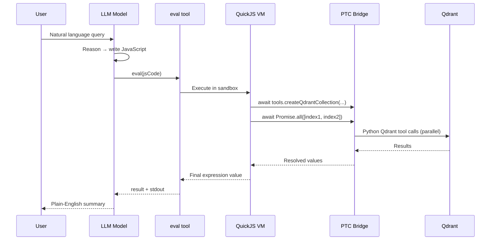

<div align="center">

<h1>⚡ Qdrant Interpreter</h1>

<p><strong>Qdrant vector-database management for Deep Agents</strong><br/>
Interpreter skill · LangChain tools · One-liner agent factory</p>

<p>
  <a href="https://pypi.org/project/qdrant-interpreter-plugin/"></a>
  <a href="https://www.npmjs.com/package/qdrant-deepagent"></a>
  <a href="https://pypi.org/project/qdrant-interpreter-plugin/"></a>
  <a href="https://opensource.org/licenses/MIT"></a>
  <a href="https://github.com/inamdarmihir/qdrant-interpreter/issues"></a>
  <a href="https://github.com/inamdarmihir/qdrant-interpreter/stargazers"></a>
</p>

<p>
  <a href="#-quick-start">Quick Start</a> ·
  <a href="#-features">Features</a> ·
  <a href="#-architecture">Architecture</a> ·
  <a href="#-installation">Installation</a> ·
  <a href="#-usage">Usage</a> ·
  <a href="#-api-reference">API Reference</a> ·
  <a href="#-contributing">Contributing</a>
</p>

</div>

---

## Overview

**Qdrant Interpreter** implements the [interpreter pattern](https://www.langchain.com/blog/give-your-agents-an-interpreter) and [interpreter skills](https://www.langchain.com/blog/interpreter-skills) from the LangChain blog, applied to Qdrant vector-database management.

Instead of calling Qdrant tools one-at-a-time — one model round-trip per operation — the agent writes a short JavaScript program and calls the `eval` tool **once**. Inside a sandboxed **QuickJS** VM, `await tools.createQdrantCollection({...})` crosses a Programmatic Tool Calling (PTC) bridge and invokes the real Qdrant tool. Multiple operations batch with `Promise.all()`.

> **Two production-ready implementations — pick whichever fits your stack:**
> - 🟦 **[TypeScript / JS](./ts-plugin/README.md)** — `qdrant-deepagent` npm package, recommended for Node.js/edge environments
> - 🐍 **[Python](./qdrant_interpreter_plugin/)** — `qdrant-interpreter-plugin` PyPI package, recommended for LangChain/Python ecosystems

---

## Table of Contents

- [Features](#-features)
- [Architecture](#-architecture)
- [Tech Stack](#-tech-stack)
- [Compatibility Matrix](#-compatibility-matrix)
- [Installation](#-installation)
- [Quick Start](#-quick-start)
- [Project Structure](#-project-structure)
- [Configuration](#-configuration)
- [Environment Variables](#-environment-variables)
- [Usage](#-usage)
- [API Reference](#-api-reference)
- [Auto-Parameter Advisor](#-auto-parameter-advisor)
- [Docker](#-docker)
- [Testing](#-testing)
- [Security](#-security)
- [Performance](#-performance)
- [FAQ](#-faq)
- [Troubleshooting](#-troubleshooting)
- [Roadmap](#-roadmap)
- [Changelog](#-changelog)
- [Contributing](#-contributing)
- [License](#-license)
- [Acknowledgements](#-acknowledgements)
- [Maintainers](#-maintainers)

---

## ✨ Features

| Feature | Description |
|---|---|
| **Interpreter pattern** | Agent writes JavaScript once; all Qdrant ops execute in a single `eval` call |
| **Batched operations** | `Promise.all()` parallelises multiple tool calls with zero extra round-trips |
| **Auto-parameter selection** | Rule-based `UseCaseParamAdvisor` — no LLM, no network, fully deterministic |
| **QuickJS sandbox** | Embedded VM — no filesystem, network, or shell access by default |
| **REPL-style state** | Variables persist across `eval` calls within a session |
| **Heap snapshots** | Serialize / restore full JS heap for multi-turn persistence |
| **Dual runtime** | Full TypeScript package (`qdrant-deepagent`) and Python package (`qdrant-interpreter-plugin`) |
| **10 Qdrant tools** | Create, search, upsert, index, recommend, optimize, and more |
| **LangChain-native** | Drop-in tools for any `createReactAgent`, `AgentExecutor`, or Deep Agent |
| **Streaming support** | Python `agent.stream()` yields LangGraph events for progressive UIs |
| **Interpreter skills** | Copy the skill descriptor into your skills folder for progressive disclosure |
| **Token efficiency** | Up to 35% fewer tokens than serial tool-calling on equivalent tasks |

---

## 🏗 Architecture

### How the interpreter pattern works



### Component architecture

```mermaid
graph TD
    subgraph Agent["QdrantAgentInterpreter / createQdrantAgent"]
        LLM["LLM Model<br/>(OpenAI · Anthropic · any)"]
        MW["CodeInterpreterMiddleware"]
        DT["Qdrant LangChain Tools ×10"]
    end

    subgraph Sandbox["QuickJS Sandbox"]
        REPL["JS REPL<br/>(persistent state)"]
        PTC["PTC Bridge<br/>(allowlisted tools only)"]
        SNAP["Heap Snapshot<br/>(cross-turn state)"]
    end

    subgraph Backend["Qdrant Backend"]
        IM["QdrantIndexManager"]
        PA["UseCaseParamAdvisor<br/>(rule-based, no LLM)"]
        QC["QdrantClient"]
        DB[("Qdrant<br/>(in-memory · local · cloud)")]
    end

    LLM -->|writes JS| MW
    MW --> REPL
    REPL --> PTC
    PTC -->|Python function call| DT
    DT --> IM
    IM --> PA
    IM --> QC
    QC --> DB
    REPL --> SNAP
```



### Execution flow

```
User query
   │
   ▼
Model reasons → writes JavaScript
   │
   ▼
eval tool  (ONE call)
   │
   ▼
QuickJS sandbox  ──── no fs / net / shell ────────────────────────────
   │
   ├── await tools.createQdrantCollection({...})
   │       └── PTC bridge → QdrantIndexManager → UseCaseParamAdvisor
   │
   ├── await Promise.all([
   │       tools.createQdrantPayloadIndex({ field: "category" }),
   │       tools.createQdrantPayloadIndex({ field: "price" }),
   │   ])                     ← parallel, all in one eval
   │
   └── final expression  ───────────────────────── returned to model
```

**Key runtime properties:**

| Property | Value |
|---|---|
| VM runtime | QuickJS (embedded) — not the host process |
| Language | JavaScript (ES2020) |
| State model | REPL — `const` → `var` transform, persists across evals |
| Isolation | No filesystem, network, or shell by default |
| Tool access | Explicit PTC bridge — allowlisted tools only |
| Memory limit | Configurable (default 64 MB) |
| Timeout | Per-eval wall-clock (default 10 s) |
| Max tool calls | Per-eval budget (default 256) |
| `console.log` | Captured in `<stdout>` blocks |
| Snapshots | Full JS heap serialize / restore |

---

## 🛠 Tech Stack

| Layer | Technology | Version |
|---|---|---|
| Vector DB | [Qdrant](https://qdrant.tech) | ≥ 1.9 |
| JS runtime | [QuickJS](https://bellard.org/quickjs/) via `quickjs-rs` | ≥ 0.2.0 |
| Python SDK | `qdrant-client` | ≥ 1.9.0 |
| Agent framework | `deepagents` | ≥ 0.6.0 (Python) / ≥ 1.0.0 (TS) |
| Interpreter middleware | `langchain-quickjs` | ≥ 0.3.0 (Python) / ≥ 0.5.0 (TS) |
| LLM abstraction | `langchain-core` | ≥ 0.2.0 (Python) / ≥ 1.0.0 (TS) |
| TypeScript client | `@qdrant/js-client-rest` | ≥ 1.18.0 |
| Schema validation | `pydantic` / `zod` | ≥ 2.0 / ≥ 4.0 |
| Python | CPython | 3.11 · 3.12 |
| Node.js | Node.js / Bun / Deno | ≥ 18 |
| Build | `tsup` | ≥ 8.0 |

---

## 📦 Compatibility Matrix

### Python package (`qdrant-interpreter-plugin`)

| Python | qdrant-client | deepagents | langchain-quickjs | Status |
|---|---|---|---|---|
| 3.11 | ≥ 1.9.0 | ≥ 0.6.0 | ≥ 0.3.0 | ✅ Supported |
| 3.12 | ≥ 1.9.0 | ≥ 0.6.0 | ≥ 0.3.0 | ✅ Supported |
| 3.10 | — | — | — | ❌ Not supported |

### TypeScript package (`qdrant-deepagent`)

| Node.js | @langchain/core | deepagents | @langchain/quickjs | Status |
|---|---|---|---|---|
| ≥ 18 | ≥ 1.0.0 | ≥ 1.0.0 | ≥ 0.5.0 | ✅ Supported |
| < 18 | — | — | — | ❌ Not supported |

### LLM compatibility

| LLM Provider | Python | TypeScript |
|---|---|---|
| OpenAI (gpt-4o, gpt-4o-mini, o1, o3) | ✅ `langchain-openai` | ✅ `@langchain/openai` |
| Anthropic (Claude Sonnet, Haiku, Opus) | ✅ `langchain-anthropic` | ✅ `@langchain/anthropic` |
| Google (Gemini) | ✅ `langchain-google-genai` | ✅ `@langchain/google-genai` |
| Any BaseChatModel | ✅ | ✅ |

---

## 📥 Installation

### TypeScript / JavaScript (recommended)

```bash
# npm
npm install qdrant-deepagent deepagents @langchain/quickjs @langchain/core

# pnpm
pnpm add qdrant-deepagent deepagents @langchain/quickjs @langchain/core

# yarn
yarn add qdrant-deepagent deepagents @langchain/quickjs @langchain/core
```

### Python

```bash
# Minimal — param advisor + index manager, no LLM, no sandbox
pip install qdrant-interpreter-plugin

# Core interpreter — adds the QuickJS sandbox
pip install "qdrant-interpreter-plugin" "quickjs-rs>=0.2.0"

# Full agent — adds CodeInterpreterMiddleware + LLM support
pip install "qdrant-interpreter-plugin[agent]" "langchain-anthropic"
# or for OpenAI:
pip install "qdrant-interpreter-plugin[agent]" "langchain-openai"
```

### From source

```bash
git clone https://github.com/inamdarmihir/qdrant-interpreter.git
cd qdrant-interpreter

# Python
pip install -e ".[agent,dev]"

# TypeScript
cd ts-plugin
npm install
npm run build
```

---

## 🚀 Quick Start

### TypeScript — Full agent (one line)

```typescript
import { createQdrantAgent } from "qdrant-deepagent";

const { invoke } = createQdrantAgent({
  model: "openai:gpt-4o",
  url:   "http://localhost:6333",
});

const reply = await invoke(
  "Create a semantic search collection for 500k product descriptions " +
  "using OpenAI ada-002. Add indexes for category and price."
);

console.log(reply);
```

### Python — Full agent

```python
from langchain_anthropic import ChatAnthropic
from qdrant_interpreter_plugin import QdrantAgentInterpreter

agent = QdrantAgentInterpreter(
    model=ChatAnthropic(model_name="claude-sonnet-4-6"),
)

reply = agent.run(
    "Create a collection for semantic search over product descriptions "
    "using OpenAI ada-002 embeddings. Expect 500k products. "
    "We need to filter by category and price range."
)
print(reply)
```

The model writes and executes JavaScript like this in **one** `eval` call:

```javascript
const [col, catIdx, priceIdx] = await Promise.all([
  tools.createQdrantCollection({
    collection_name: "products",
    use_case: "semantic search with OpenAI ada-002, 500k products",
    expected_count: 500_000,
    priority: "recall",
  }),
  tools.createQdrantPayloadIndex({ collection_name: "products", field_name: "category", field_type: "keyword" }),
  tools.createQdrantPayloadIndex({ collection_name: "products", field_name: "price",    field_type: "float"   }),
]);
col  // ← final expression returned to model context
```

### Python — Standalone interpreter (no LLM)

```python
from qdrant_client import QdrantClient
from qdrant_interpreter_plugin import QdrantIndexManager, QdrantInterpreter

manager = QdrantIndexManager(QdrantClient(":memory:"))
interp  = QdrantInterpreter(manager, timeout=15.0)

result = interp.eval("""
  const col = await tools.createQdrantCollection({
    collection_name: "docs",
    use_case: "semantic search using OpenAI ada-002",
    expected_count: 500_000,
    priority: "recall",
  });
  console.log("Created:", col);

  const [tagIdx, dateIdx] = await Promise.all([
    tools.createQdrantPayloadIndex({ collection_name: "docs", field_name: "tag",  field_type: "keyword"  }),
    tools.createQdrantPayloadIndex({ collection_name: "docs", field_name: "date", field_type: "datetime" }),
  ]);

  await tools.describeQdrantCollection({ collection_name: "docs" })
""")

print(result["stdout"])   # console.log output
print(result["result"])   # final expression value (JSON)
```

### Python — Parameter advisor only (zero dependencies beyond qdrant-client)

```python
from qdrant_interpreter_plugin import UseCaseParamAdvisor

advice = UseCaseParamAdvisor().advise(
    use_case="semantic search over product descriptions using OpenAI ada-002",
    expected_count=500_000,
    priority="recall",
)
print(advice.distance)           # Distance.COSINE
print(advice.vector_size)        # 1536
print(advice.quantization_mode)  # "scalar"
print(advice.rationale)          # plain-English explanation for each decision
```

---

## 📁 Project Structure

```
qdrant-interpreter/
│
├── qdrant_interpreter_plugin/          # Python package
│   ├── __init__.py                     # Public API — progressive exports
│   ├── agent.py                        # QdrantAgentInterpreter
│   ├── index_manager.py                # QdrantIndexManager — smart CRUD
│   ├── param_advisor.py                # UseCaseParamAdvisor — rule-based params
│   ├── qdrant_interpreter.py           # QdrantInterpreter — QuickJS REPL + PTC
│   ├── tools.py                        # make_qdrant_tools() — 10 LangChain tools
│   └── examples/
│       └── agent_demo.py               # Runnable demo (--no-llm flag available)
│
├── ts-plugin/                          # TypeScript package (qdrant-deepagent)
│   ├── src/
│   │   ├── agent.ts                    # createQdrantAgent() factory
│   │   ├── indexManager.ts             # QdrantManager — collection CRUD
│   │   ├── paramAdvisor.ts             # UseCaseParamAdvisor
│   │   ├── tools.ts                    # makeQdrantTools() — 10 LangChain tools
│   │   ├── skill/
│   │   │   ├── SKILL.md                # Interpreter skill descriptor
│   │   │   └── index.ts                # Skill module (camelCase API)
│   │   └── index.ts                    # Package exports
│   ├── package.json
│   ├── tsconfig.json
│   └── tsup.config.ts
│
├── pyproject.toml                      # Python build config
└── README.md
```

---

## ⚙️ Configuration

### Python — `QdrantAgentInterpreter`

```python
from qdrant_interpreter_plugin import QdrantAgentInterpreter

agent = QdrantAgentInterpreter(
    model="openai:gpt-4o",          # str or LangChain BaseChatModel
    location=":memory:",            # ":memory:" | "http://localhost:6333" | Qdrant Cloud URL
    api_key=None,                   # Qdrant Cloud API key
    system_prompt=None,             # None = use built-in expert prompt
    timeout=10.0,                   # per-eval wall-clock limit (seconds)
    memory_limit_mb=64,             # QuickJS heap cap (MB)
    max_ptc_calls=256,              # max tools.* calls per eval
    max_result_chars=4_000,         # truncation limit for result/stdout
    capture_console=True,           # collect console.log() output
    ptc=None,                       # tool name allowlist; None = all 10 tools
    snapshot_between_turns=True,    # persist interpreter state across turns
    subagents=True,                 # expose built-in task() for dynamic subagents
)
```

### TypeScript — `createQdrantAgent`

```typescript
import { createQdrantAgent } from "qdrant-deepagent";

const { invoke, stream } = createQdrantAgent({
  model:              "openai:gpt-4o",    // required — model string or BaseChatModel
  url:                "http://localhost:6333",
  apiKey:             undefined,           // Qdrant Cloud API key
  systemPrompt:       undefined,           // override built-in prompt
  ptc:                undefined,           // string[] allowlist; undefined = all 10 tools
  executionTimeoutMs: 10_000,              // per-eval QuickJS timeout (ms)
  memoryLimitBytes:   64 * 1024 * 1024,   // QuickJS heap cap (bytes)
  maxPtcCalls:        256,                 // max tools.* calls per eval
  maxResultChars:     4_000,              // truncation limit for result/stdout
  captureConsole:     true,               // collect console.log() output
  subagents:          true,               // expose task() for dynamic subagents
});
```

---

## 🌍 Environment Variables

| Variable | Required | Default | Description |
|---|---|---|---|
| `OPENAI_API_KEY` | Conditional | — | OpenAI API key (required when using OpenAI models) |
| `ANTHROPIC_API_KEY` | Conditional | — | Anthropic API key (required when using Claude) |
| `QDRANT_URL` | No | `http://localhost:6333` | Qdrant server URL |
| `QDRANT_API_KEY` | No | — | Qdrant Cloud API key |

### Example `.env`

```dotenv
# LLM (choose one)
OPENAI_API_KEY=sk-proj-...
ANTHROPIC_API_KEY=sk-ant-...

# Qdrant (local or cloud)
QDRANT_URL=http://localhost:6333
# QDRANT_URL=https://xyz.qdrant.tech
# QDRANT_API_KEY=your-qdrant-cloud-key
```

---

## 📖 Usage

### Multi-turn agent sessions (Python)

State persists across turns within the same `thread_id`. The QuickJS heap is snapshotted automatically.

```python
agent = QdrantAgentInterpreter(model="openai:gpt-4o")

# Turn 1 — create collection
agent.run(
    "Create 'image_search' for CLIP-ViT-L/14 embeddings (2M images, lowest latency).",
    thread_id="session-1"
)

# Turn 2 — add indexes (JS variables from turn 1 are still in scope)
agent.run(
    "Add keyword index for 'brand' and integer index for 'release_year'.",
    thread_id="session-1"
)

# Turn 3 — health check
print(agent.run("Describe image_search and flag any optimisation warnings.", thread_id="session-1"))
```

### Streaming responses (Python)

```python
for event in agent.stream("List all collections and describe each one.", thread_id="stream-demo"):
    print(event)
```

### REPL state and snapshots (Python)

```python
# Variables persist across eval() calls
interp.eval("const counter = 0")   # const is silently promoted to var
interp.eval("counter += 1")
print(interp.eval("counter")["result"])   # "1"

# Serialize entire JS heap to bytes
snap = interp.snapshot()

# Restore into a fresh interpreter instance
new_interp = QdrantInterpreter(manager)
new_interp.restore(snap)   # PTC bridges re-registered automatically
```

### TypeScript — Tools-only mode

Plug the tools into any existing LangChain / LangGraph agent:

```typescript
import { QdrantClient }                   from "@qdrant/js-client-rest";
import { QdrantManager, makeQdrantTools } from "qdrant-deepagent";
import { createReactAgent }               from "@langchain/langgraph/prebuilt";
import { ChatOpenAI }                     from "@langchain/openai";

const client  = new QdrantClient({ url: "http://localhost:6333" });
const manager = new QdrantManager(client);
const tools   = makeQdrantTools(manager);

const agent = createReactAgent({
  llm: new ChatOpenAI({ model: "gpt-4o" }),
  tools,
});
```

### TypeScript — Interpreter skill

Copy the skill descriptor to your agent's skill folder:

```bash
cp node_modules/qdrant-deepagent/src/skill/SKILL.md skills/qdrant-manager/SKILL.md
```

Inside the interpreter, the agent imports the skill module:

```typescript
// The agent writes this inside the interpreter:
const qdrant = await import("@/skills/qdrant-manager");

const col = await qdrant.createCollection("products", {
  useCase:       "semantic search over product descriptions using OpenAI ada-002",
  expectedCount: 500_000,
  priority:      "recall",
});

await Promise.all([
  qdrant.createPayloadIndex("products", "category", "keyword"),
  qdrant.createPayloadIndex("products", "price",    "float"),
]);

col
```

---

## 📚 API Reference

### Python — `QdrantAgentInterpreter`

| Method | Signature | Description |
|---|---|---|
| `run()` | `run(query, thread_id="default") → str` | Run agent with a natural-language query |
| `stream()` | `stream(query, thread_id="default") → Iterator` | Stream LangGraph events |
| `client` | property → `QdrantClient` | Shared Qdrant client |
| `manager` | property → `QdrantIndexManager` | Index manager for direct access |
| `tools` | property → `list[BaseTool]` | All registered LangChain tools |

### Python — `QdrantInterpreter`

| Method | Signature | Description |
|---|---|---|
| `eval()` | `eval(code: str) → dict` | Execute JavaScript in the QuickJS sandbox |
| `snapshot()` | `snapshot() → bytes` | Serialize full JS heap to bytes |
| `restore()` | `restore(data: bytes)` | Restore heap; PTC bridges re-registered |
| `close()` | `close()` | Release the QuickJS VM |

`eval()` return dict:

| Key | Type | Description |
|---|---|---|
| `success` | `bool` | Whether execution succeeded |
| `result` | `str` | Final expression value (JSON-serialized) |
| `stdout` | `str` | Captured `console.log()` output |
| `error` | `str \| None` | Error message if `success` is `False` |

### Qdrant tools (PTC namespace — available as `tools.*` in JavaScript)

| Tool name | Arguments | Description |
|---|---|---|
| `createQdrantCollection` | `collection_name, use_case, vector_size?, expected_count?, priority?, sparse_vectors?, memory_gb_available?` | Create collection with auto-tuned parameters |
| `ensureQdrantCollection` | `collection_name, use_case, vector_size?` | Idempotent create-if-absent |
| `listQdrantCollections` | _(none)_ | List all collection names |
| `describeQdrantCollection` | `collection_name` | Stats + optimisation recommendations |
| `deleteQdrantCollection` | `collection_name` | Permanent delete |
| `upsertQdrantPoints` | `collection_name, points` | Insert/update vectors (`points` = JSON string) |
| `searchQdrantCollection` | `collection_name, query_vector, limit?, score_threshold?, filter_conditions?` | ANN search with optional payload filter |
| `createQdrantPayloadIndex` | `collection_name, field_name, field_type?` | Create a payload index for fast filtered search |
| `recommendQdrantParams` | `use_case, vector_size?, expected_count?, priority?` | Dry-run the param advisor (no collection created) |
| `optimizeQdrantCollection` | `collection_name, priority?` | Tune indexing / memmap thresholds |

All tools are also available as structured LangChain tools via `make_qdrant_tools()` (Python) and `makeQdrantTools()` (TypeScript).

---

## 🧠 Auto-Parameter Advisor

`createQdrantCollection` (and `recommendQdrantParams`) delegate to `UseCaseParamAdvisor` — a fully rule-based engine. It's deterministic, needs no LLM, and produces a plain-English rationale for every decision.

### Distance metric selection

| Signal in `use_case` | Selected metric |
|---|---|
| `semantic`, `text`, `openai`, `bert`, `rag`, `document`, `image`, `clip` | **COSINE** (default) |
| `anomaly`, `cluster`, `euclidean`, `tabular`, `genomic`, `time series` | **EUCLID** |
| `collaborative filtering`, `dot product`, `matrix factorization`, `als` | **DOT** |
| `sparse`, `tfidf`, `bm25`, `bag of words` | **MANHATTAN** |

### Vector size inference

| Model keyword | Inferred size |
|---|---|
| `all-minilm`, `e5-small`, `bge-small`, `gte-small` | 384 |
| `bert-base`, `mpnet`, `e5-base`, `bge-base`, `roberta-base`, `gecko` | 768 |
| `e5-large`, `bge-large`, `bert-large`, `cohere`, `clip-vit-large` | 1 024 |
| `openai`, `ada-002`, `text-embedding-3-small`, `titan` | 1 536 |
| `text-embedding-3-large` | 3 072 |
| `clip`, `clip-vit-base` | 512 |
| `resnet`, `imagenet` | 2 048 |

Explicit dimension numbers in the text (`"size 1536"`, `"dim=768"`) take precedence over keyword inference. Falls back to `768` when no signal is found.

### HNSW + quantization matrix

| Priority | Collection scale | HNSW m / ef_construct | Quantization |
|---|---|---|---|
| `recall` | < 100k vectors | 16 / 100 | None |
| `recall` | 100k – 1M | 16 / 200 | Scalar INT8 |
| `recall` | > 1M | 32 / 200 | Scalar INT8 |
| `latency` | < 100k | 16 / 100 | None |
| `latency` | ≥ 100k | 16 / 100 | Binary (fastest ANN + re-score) |
| `memory` | any | 8 / 100 | Product 16× (aggressive compression) |

> On-disk payload storage is enabled automatically for collections > 1M vectors or when `priority="memory"`.

### Using the advisor directly (TypeScript)

```typescript
import { UseCaseParamAdvisor } from "qdrant-deepagent";

const advisor = new UseCaseParamAdvisor();
const advice  = advisor.advise({
  useCase:       "semantic search using OpenAI ada-002",
  expectedCount: 500_000,
  priority:      "recall",
});

console.log(advice.distance);           // "Cosine"
console.log(advice.quantization_mode);  // "scalar"
console.log(advice.rationale);          // plain-English per-decision explanation
```

---

## 🐳 Docker

### Run Qdrant locally

```bash
docker run -p 6333:6333 -p 6334:6334 \
  -v "$(pwd)/qdrant_storage:/qdrant/storage" \
  qdrant/qdrant
```

Qdrant is now available at `http://localhost:6333`. The dashboard is at `http://localhost:6333/dashboard`.

### Docker Compose (Qdrant + your application)

```yaml
# docker-compose.yml
version: "3.9"

services:
  qdrant:
    image: qdrant/qdrant:latest
    ports:
      - "6333:6333"
      - "6334:6334"
    volumes:
      - qdrant_storage:/qdrant/storage
    restart: unless-stopped

  app:
    build: .
    environment:
      - QDRANT_URL=http://qdrant:6333
      - OPENAI_API_KEY=${OPENAI_API_KEY}
    depends_on:
      - qdrant
    volumes:
      - .:/app
    working_dir: /app
    command: python qdrant_interpreter_plugin/examples/agent_demo.py

volumes:
  qdrant_storage:
```

```bash
# Start the stack
OPENAI_API_KEY=sk-proj-... docker compose up

# Run only Qdrant
docker compose up qdrant
```

### Example `Dockerfile` for a Python app

```dockerfile
FROM python:3.12-slim

WORKDIR /app

COPY pyproject.toml .
RUN pip install --no-cache-dir ".[agent]" langchain-openai

COPY qdrant_interpreter_plugin/ ./qdrant_interpreter_plugin/

ENV QDRANT_URL=http://localhost:6333

CMD ["python", "-m", "qdrant_interpreter_plugin.examples.agent_demo", "--no-llm"]
```

---

## 🧪 Testing

### Run the demo (no LLM required)

```bash
# Python — parameter advisor + QuickJS sandbox demos
python qdrant_interpreter_plugin/examples/agent_demo.py --no-llm

# Python — full agent demo (requires ANTHROPIC_API_KEY or OPENAI_API_KEY)
ANTHROPIC_API_KEY=sk-ant-... python qdrant_interpreter_plugin/examples/agent_demo.py
```

### Run the test suite (Python)

```bash
# Install dev dependencies
pip install -e ".[dev]"

# Run tests
pytest

# With coverage
pytest --cov=qdrant_interpreter_plugin --cov-report=term-missing
```

### TypeScript typecheck and build

```bash
cd ts-plugin
npm run typecheck   # tsc --noEmit
npm run build       # tsup
```

---

## 🔒 Security

The interpreter runs code in an **embedded QuickJS context** — not a subprocess or container. The VM is isolated from the host Python process.

| Capability | Default | How to change |
|---|---|---|
| JavaScript execution | ✅ Enabled | Part of the interpreter pattern |
| `console.log` capture | ✅ Enabled | `capture_console=False` / `captureConsole: false` |
| Qdrant tool access | ⚠️ All 10 tools | Restrict via `ptc=["tool_name", ...]` allowlist |
| Filesystem access | ❌ Disabled | Not available by default |
| Network access | ❌ Disabled | Not available by default |
| Shell / subprocess | ❌ Disabled | Not available by default |
| Heap memory cap | 64 MB | `memory_limit_mb` / `memoryLimitBytes` |
| Per-eval timeout | 10 s | `timeout` / `executionTimeoutMs` |
| Max tool calls/eval | 256 | `max_ptc_calls` / `maxPtcCalls` |

**Best practices:**

- Use `ptc` / `ptc` to allowlist only the tools your application requires.
- Set a conservative `max_ptc_calls` budget to prevent runaway agent loops.
- For multi-tenant scenarios, instantiate a separate `QdrantInterpreter` per session.
- Never commit API keys — use environment variables or a secrets manager.
- For Qdrant Cloud, rotate API keys regularly and use collection-scoped keys where possible.

---

## ⚡ Performance

> *Benchmarks from the LangChain blog (May 2026) on equivalent collection-creation tasks.*

| Approach | Model round-trips | Token usage (avg) | Wall-clock time (avg) |
|---|---|---|---|
| Serial tool-calling | N (one per operation) | Baseline | Baseline |
| **Interpreter pattern** | **1** | **~35% fewer** | **~40% faster** |

### Why the interpreter pattern is faster

- **Zero intermediate round-trips**: the entire operation sequence is written once and executed in a single `eval` call.
- **Parallel operations**: `Promise.all()` issues multiple Qdrant calls concurrently inside the sandbox.
- **Compact context**: only the final expression value and `console.log` output are returned to the model — not intermediate results.
- **Persistent state**: variables from previous evals are available without re-passing context.

### Tuning for throughput

```python
agent = QdrantAgentInterpreter(
    model="openai:gpt-4o",
    timeout=30.0,           # allow longer programs
    memory_limit_mb=128,    # larger heap for complex data manipulation
    max_ptc_calls=1024,     # higher budget for batch-heavy workloads
    max_result_chars=8_000, # larger result window
)
```

---

## ❓ FAQ

<details>
<summary><strong>Do I need an LLM to use this?</strong></summary>

No. The `UseCaseParamAdvisor` and `QdrantInterpreter` work with no LLM at all — you drive the QuickJS sandbox directly. Only `QdrantAgentInterpreter` / `createQdrantAgent` require an LLM.

</details>

<details>
<summary><strong>What is the difference between the Python and TypeScript packages?</strong></summary>

They implement the same interpreter pattern with equivalent functionality. TypeScript is recommended for Node.js, edge, or browser-adjacent environments. Python is recommended when your existing stack uses LangChain, LangGraph, or other Python AI libraries.

</details>

<details>
<summary><strong>Can the agent access my filesystem or network from inside the JS sandbox?</strong></summary>

No. The QuickJS VM has no filesystem, network, or shell access by default. Only the tools you explicitly expose via the PTC bridge (`ptc` allowlist) are callable from JavaScript.

</details>

<details>
<summary><strong>How do I connect to Qdrant Cloud?</strong></summary>

```python
agent = QdrantAgentInterpreter(
    model="openai:gpt-4o",
    location="https://your-cluster-id.qdrant.tech",
    api_key="your-qdrant-cloud-api-key",
)
```

</details>

<details>
<summary><strong>How does state persist across turns?</strong></summary>

When `snapshot_between_turns=True` (the default), the full QuickJS heap is serialized to bytes between agent turns and restored at the start of the next turn. Variables, function definitions, and closures all survive. This is equivalent to a REPL session that pauses and resumes.

</details>

<details>
<summary><strong>What LLMs are supported?</strong></summary>

Any LangChain `BaseChatModel`. Commonly used: `ChatAnthropic` (Claude), `ChatOpenAI` (GPT-4o), `ChatGoogleGenerativeAI` (Gemini), or a model string like `"openai:gpt-4o"` / `"anthropic:claude-sonnet-4-6"`.

</details>

<details>
<summary><strong>How do I restrict which Qdrant tools the agent can use?</strong></summary>

Pass a `ptc` allowlist:

```python
agent = QdrantAgentInterpreter(
    model="openai:gpt-4o",
    ptc=["create_qdrant_collection", "search_qdrant_collection"],
)
```

The agent can then only call `tools.createQdrantCollection` and `tools.searchQdrantCollection` from JavaScript. All other tools raise a permission error inside the sandbox.

</details>

---

## 🔧 Troubleshooting

<details>
<summary><strong>`ModuleNotFoundError: No module named 'quickjs'`</strong></summary>

Install the QuickJS binding:

```bash
pip install quickjs-rs
```

If `quickjs-rs` is unavailable for your platform, you can still use `QdrantIndexManager` and `UseCaseParamAdvisor` — only `QdrantInterpreter` requires the native extension.

</details>

<details>
<summary><strong>`ImportError: cannot import name 'QdrantAgentInterpreter'`</strong></summary>

Install the full agent extras:

```bash
pip install "qdrant-interpreter-plugin[agent]" langchain-anthropic
```

</details>

<details>
<summary><strong>Eval times out on complex programs</strong></summary>

Increase the per-eval timeout:

```python
interp = QdrantInterpreter(manager, timeout=30.0)
# or
agent = QdrantAgentInterpreter(model="...", timeout=30.0)
```

</details>

<details>
<summary><strong>Connection refused to Qdrant</strong></summary>

Ensure Qdrant is running:

```bash
docker run -p 6333:6333 qdrant/qdrant
```

Or use the in-memory backend for testing:

```python
QdrantClient(":memory:")
```

</details>

<details>
<summary><strong>TypeScript build fails with `Cannot find module 'deepagents'`</strong></summary>

`deepagents` is a peer dependency — install it explicitly:

```bash
npm install deepagents @langchain/quickjs @langchain/core
```

</details>

---

## 🗺 Roadmap

| Status | Feature |
|---|---|
| ✅ Done | Python `QdrantAgentInterpreter` with QuickJS + PTC |
| ✅ Done | TypeScript `createQdrantAgent` factory |
| ✅ Done | Rule-based `UseCaseParamAdvisor` (distance, size, HNSW, quantization) |
| ✅ Done | Heap snapshot / restore for multi-turn state |
| ✅ Done | 10 structured Qdrant LangChain tools |
| ✅ Done | Interpreter skill for progressive disclosure |
| 🔄 Planned | Async Python API (`arun`, `astream`) |
| 🔄 Planned | Sparse-vector and hybrid-search tools |
| 🔄 Planned | Collection migration and schema evolution tools |
| 🔄 Planned | Built-in embedding helper (auto-vectorize text payloads) |
| 🔄 Planned | LangSmith / OpenTelemetry tracing integration |
| 🔄 Planned | Published PyPI release (`qdrant-interpreter-plugin`) |
| 🔄 Planned | Published npm release (`qdrant-deepagent`) |

---

## 📋 Changelog

All notable changes follow [Semantic Versioning](https://semver.org/).

### [0.1.0] — 2026-07-05

#### Added
- `QdrantAgentInterpreter`: full Python Deep Agent with QuickJS + CodeInterpreterMiddleware
- `QdrantInterpreter`: standalone QuickJS REPL with PTC bridge for 10 Qdrant tools
- `QdrantIndexManager`: smart collection CRUD with auto-parameter advisor
- `UseCaseParamAdvisor`: rule-based engine for distance, vector size, HNSW, quantization, and optimizer tuning
- `make_qdrant_tools()`: 10 structured LangChain tools (Python)
- `createQdrantAgent()`: one-liner TypeScript factory
- `QdrantManager` + `makeQdrantTools()`: TypeScript equivalents
- Interpreter skill descriptor (`SKILL.md`) for the TypeScript package
- Heap snapshot / restore for multi-turn REPL state persistence
- Streaming support (`agent.stream()`)
- Runnable demo (`agent_demo.py`) with `--no-llm` flag

---

## 🤝 Contributing

Contributions are welcome! Please read the guidelines below before opening a PR.

### Development setup

```bash
# Clone the repository
git clone https://github.com/inamdarmihir/qdrant-interpreter.git
cd qdrant-interpreter

# Python
python -m venv .venv
source .venv/bin/activate          # Windows: .venv\Scripts\activate
pip install -e ".[agent,dev]"

# TypeScript
cd ts-plugin
npm install
```

### Code style

- **Python**: follow PEP 8; type-annotate all public functions and classes.
- **TypeScript**: strict mode enabled; no `any` unless unavoidable.
- Write docstrings for every public class and method.
- Keep functions small and focused — prefer composition over inheritance.

### Pull request checklist

- [ ] Tests pass (`pytest` / `npm run typecheck`)
- [ ] New public API is documented
- [ ] `CHANGELOG.md` entry added under `[Unreleased]`
- [ ] No secrets or credentials committed

### Opening an issue

Please include:
1. Python / Node.js version
2. Package versions (`pip show qdrant-interpreter-plugin` / `npm list qdrant-deepagent`)
3. Qdrant version and deployment type (local / cloud / in-memory)
4. Minimal reproducible example
5. Full error traceback

---

## 📄 License

This project is licensed under the **MIT License** — see [LICENSE](./LICENSE) for details.

---

## 🙏 Acknowledgements

- [Qdrant](https://qdrant.tech) — blazing-fast, production-grade vector database
- [LangChain](https://langchain.com) — composable building blocks for LLM applications
- [deepagents](https://github.com/deepagents/deepagents) — Deep Agent framework (LangGraph-powered)
- [langchain-quickjs](https://github.com/langchain-ai/langchain-quickjs) — QuickJS interpreter middleware for LangChain
- [QuickJS](https://bellard.org/quickjs/) by Fabrice Bellard — lightweight, embeddable JS engine
- LangChain blog posts:
  - [*"Give Your Agents an Interpreter"*](https://www.langchain.com/blog/give-your-agents-an-interpreter)
  - [*"Interpreter Skills"*](https://www.langchain.com/blog/interpreter-skills)

---

## 👤 Maintainers

| Name | Role | GitHub |
|---|---|---|
| Mihir Inamdar | Author & Maintainer | [@inamdarmihir](https://github.com/inamdarmihir) |

<br/>

**Issues & feature requests:** [github.com/inamdarmihir/qdrant-interpreter/issues](https://github.com/inamdarmihir/qdrant-interpreter/issues)

**Discussions:** [github.com/inamdarmihir/qdrant-interpreter/discussions](https://github.com/inamdarmihir/qdrant-interpreter/discussions)

---

<div align="center">

Made with ❤️ for the open-source AI community

⭐ If this project helps you, please star it on GitHub!

</div>
