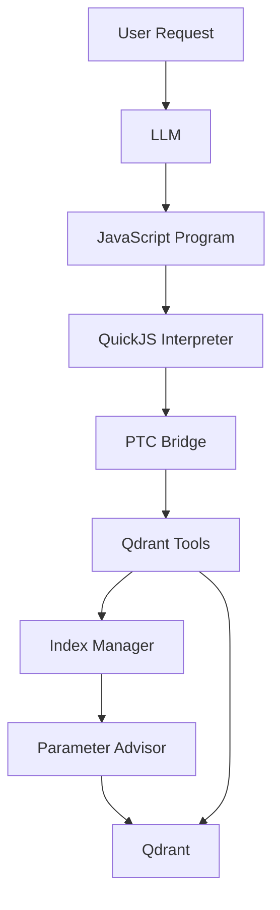

# Qdrant Interpreter Plugin

> **Interpreter-first Qdrant management for AI agents.**
>
> Build, optimize, and manage Qdrant collections through a sandboxed JavaScript interpreter that batches vector database operations into a **single tool invocation**, dramatically reducing LLM round-trips while following LangChain's **Interpreter** and **Interpreter Skills** patterns. ([GitHub][1])

<p align="center">


</p>

---

## Why Qdrant Interpreter?

Traditional AI agents execute vector database operations one tool call at a time.

```
LLM
 ├── create_collection()
 ├── create_payload_index()
 ├── optimize_collection()
 ├── describe_collection()
 └── search()
```

Every operation requires another reasoning cycle.

This project instead implements the **Interpreter Pattern**:

```
LLM
      │
      ▼
Writes JavaScript once
      │
      ▼
QuickJS Interpreter
      │
      ├── createCollection()
      ├── createPayloadIndex()
      ├── optimizeCollection()
      ├── search()
      └── Promise.all(...)
      │
      ▼
Single eval()
      │
      ▼
Final answer returned to the LLM
```

The interpreter executes an entire workflow inside a sandbox while only exposing the final result back to the model.

---

# Features

| Feature                              | Supported |
| ------------------------------------ | --------- |
| QuickJS Interpreter                  | ✅         |
| LangChain Deep Agents                | ✅         |
| Persistent Interpreter State         | ✅         |
| Interpreter Skills                   | ✅         |
| Programmatic Tool Calling (PTC)      | ✅         |
| Parallel Tool Execution              | ✅         |
| Snapshot / Restore                   | ✅         |
| Memory Limits                        | ✅         |
| Timeout Protection                   | ✅         |
| Tool Allowlisting                    | ✅         |
| Sandboxed Runtime                    | ✅         |
| Automatic Qdrant Parameter Selection | ✅         |
| Standalone Interpreter               | ✅         |
| Python Agent                         | ✅         |
| TypeScript Agent                     | ✅         |

---

# Architecture



---

# Repository Layout

```
qdrant-interpreter/

├── ts-plugin/
│   ├── src/
│   └── README.md
│
├── qdrant_interpreter_plugin/
│   ├── agent.py
│   ├── qdrant_interpreter.py
│   ├── index_manager.py
│   ├── param_advisor.py
│   ├── tools.py
│   └── examples/
│
├── pyproject.toml
├── README.md
└── LICENSE
```

---

# Components

## QuickJS Interpreter

Provides

* Persistent JavaScript runtime
* REPL-style execution
* Snapshots
* Console capture
* Timeout enforcement
* Memory limits

---

## Programmatic Tool Calling

Interpreter code accesses Python tools through

```
await tools.createQdrantCollection(...)
```

instead of direct Python execution.

---

## Qdrant Index Manager

Responsible for

* Collection creation
* Payload indexes
* Search
* Optimization
* Collection inspection

---

## UseCase Parameter Advisor

Automatically selects

* Distance metric
* Vector size
* HNSW parameters
* Quantization
* Optimizer settings

without requiring another LLM.

---

# Installation

## Python

```bash
pip install qdrant-client quickjs-rs
```

Full Agent

```bash
pip install \
    deepagents[quickjs] \
    langchain-quickjs \
    langchain-anthropic
```

Clone

```bash
git clone https://github.com/inamdarmihir/qdrant-interpreter.git

cd qdrant-interpreter

pip install -e ".[agent]"
```

---

## TypeScript

```bash
npm install \
qdrant-deepagent \
deepagents \
@langchain/core \
@langchain/quickjs
```

---

# Quick Start

## Python

```python
from langchain_anthropic import ChatAnthropic

from qdrant_interpreter_plugin import QdrantAgentInterpreter

agent = QdrantAgentInterpreter(
    model=ChatAnthropic(
        model_name="claude-sonnet-4-6"
    )
)

print(agent.run(
    "Create a semantic search collection for 500k products"
))
```

---

## TypeScript

```typescript
import { createQdrantAgent } from "qdrant-deepagent";

const { invoke } = createQdrantAgent({
    model: "openai:gpt-4o"
});

await invoke(
    "Create a semantic search collection for 500k products"
);
```

---

# Interpreter Execution

Instead of

```
Tool
↓

Tool
↓

Tool
↓

Tool
```

the model writes

```javascript
const [collection, category, price] =
await Promise.all([

tools.createQdrantCollection(...),

tools.createQdrantPayloadIndex(...),

tools.createQdrantPayloadIndex(...)

]);

collection
```

Only **one** interpreter invocation is sent to the model.

---

# Supported Qdrant Operations

| Operation            | Supported |
| -------------------- | --------- |
| Create Collection    | ✅         |
| Ensure Collection    | ✅         |
| Delete Collection    | ✅         |
| Search               | ✅         |
| Upsert Points        | ✅         |
| Payload Index        | ✅         |
| Describe Collection  | ✅         |
| Optimize Collection  | ✅         |
| Recommend Parameters | ✅         |
| List Collections     | ✅         |

---

# Automatic Parameter Selection

The rule-based advisor automatically configures

* Vector size
* Distance metric
* HNSW
* Quantization
* Optimizer settings

based on

* embedding model
* dataset size
* use case
* latency target
* recall priority

without additional LLM calls.

---

# Configuration

```python
QdrantAgentInterpreter(

model="openai:gpt-4o",

location=":memory:",

timeout=10,

memory_limit_mb=64,

max_ptc_calls=256,

capture_console=True,

snapshot_between_turns=True,

subagents=True,

)
```

---

# Security

The interpreter executes inside a sandbox.

Restrictions include

* No filesystem access
* No shell access
* No network access
* Allowlisted tools only
* Configurable execution timeout
* Memory limits
* Maximum tool-call budget

---

# Performance Characteristics

| Capability                   | Benefit                    |
| ---------------------------- | -------------------------- |
| Single Interpreter Execution | Fewer LLM round-trips      |
| Promise.all                  | Parallel tool execution    |
| Persistent Runtime           | REPL-like workflows        |
| Snapshot / Restore           | Fast long-running sessions |
| Rule-based Advisor           | Zero inference cost        |
| QuickJS Runtime              | Lightweight execution      |

---

# Use Cases

* AI Engineering Agents
* Autonomous Qdrant Administration
* Semantic Search
* RAG Infrastructure
* Collection Migration
* Embedding Model Migration
* Vector Database Automation
* Agentic DevOps
* Intelligent Index Optimization

---

# Comparison

| Traditional Tool Calling | Interpreter Pattern    |
| ------------------------ | ---------------------- |
| Multiple LLM calls       | Single eval            |
| Higher latency           | Lower latency          |
| More tokens              | Fewer tokens           |
| Sequential execution     | Parallel execution     |
| Stateless                | Persistent interpreter |
| Difficult batching       | Native Promise.all     |

---

# Roadmap

* [x] QuickJS interpreter
* [x] LangChain integration
* [x] Python implementation
* [x] TypeScript implementation
* [x] Snapshot support
* [x] Interpreter Skills
* [ ] Streaming execution
* [ ] Async collection monitoring
* [ ] Hybrid Search helpers
* [ ] Multi-vector optimization
* [ ] Qdrant Cloud deployment helpers
* [ ] MCP server integration

---

# Contributing

Contributions are welcome.

Areas of interest include

* Additional Qdrant tools
* Interpreter Skills
* LangGraph integration
* Performance optimization
* Testing
* Documentation
* Examples

---

# Acknowledgements

This project is inspired by:

* LangChain **Interpreter Pattern**
* LangChain **Interpreter Skills**
* Deep Agents
* QuickJS
* Qdrant Vector Database
* LangChain Programmatic Tool Calling (PTC) ([GitHub][1])

---

# License

Educational use. Adapt freely.

[1]: https://github.com/qdrant/qdrant?utm_source=chatgpt.com "GitHub - qdrant/qdrant: Qdrant - High-performance, massive-scale Vector Database and Vector Search Engine for the next generation of AI. Also available in the cloud https://cloud.qdrant.io/ · GitHub"
